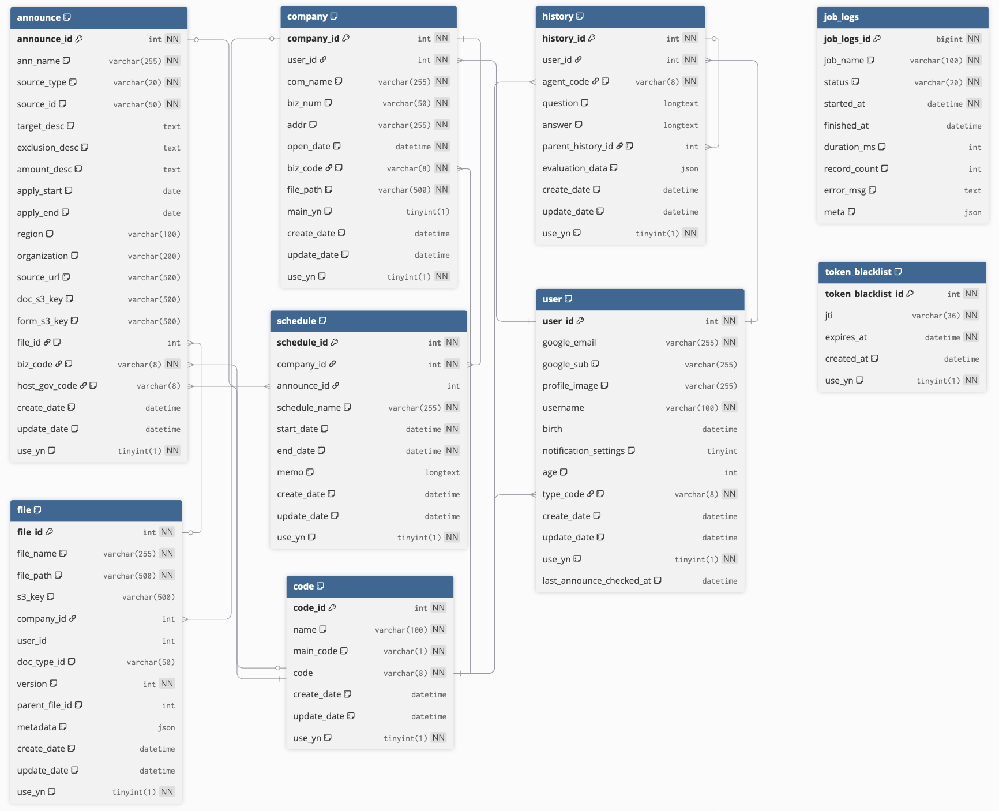
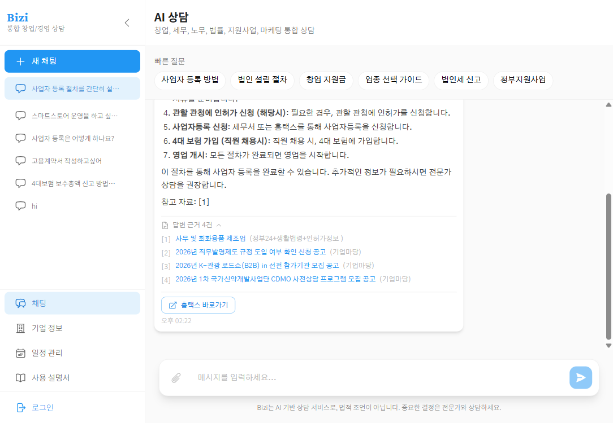
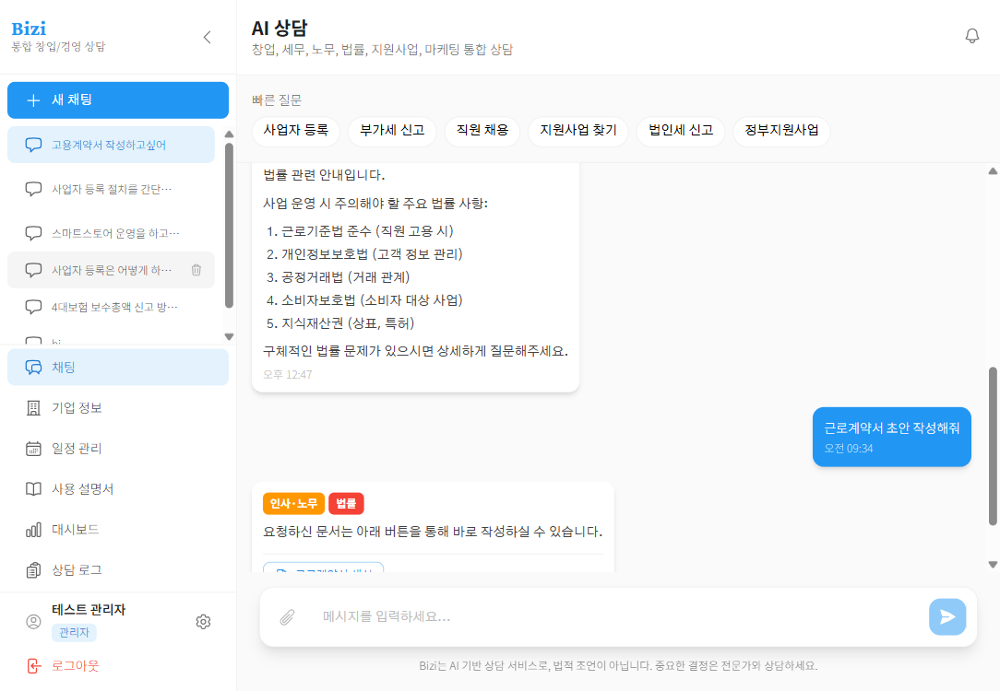
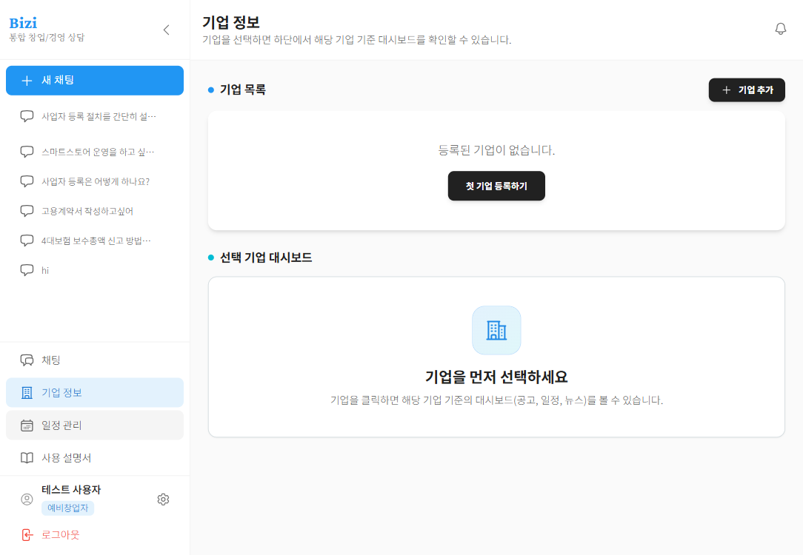
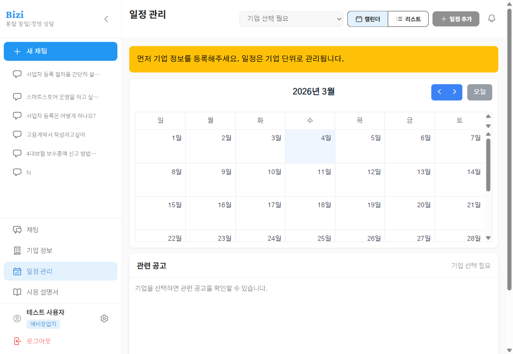
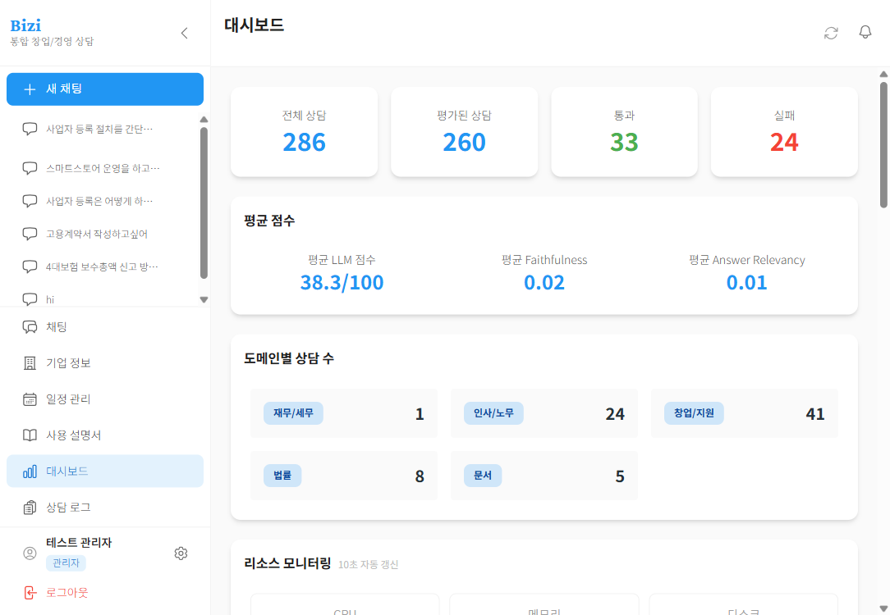
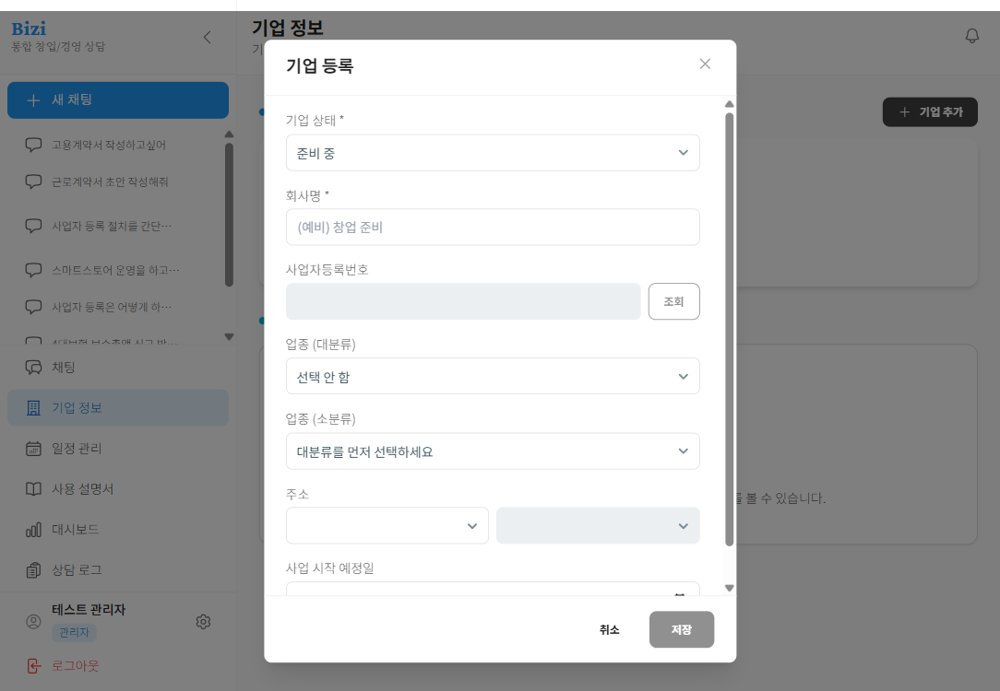

<div align="center">


> **"예비 창업자·스타트업 CEO·중소기업 대표가 경영 의사결정을 할 때,**  
> **가장 먼저 찾아보는 AI 통합 경영 파트너를 만드는 것."**
>
> 창업 · 세무 · 노무 · 법률 4개 도메인, **21만 건** 이상의 법령·가이드 문서 기반  
> 신뢰할 수 있는 AI 경영 컨설팅을 하나의 플랫폼에서

<br/>

</div>

---

## 📌 목차

- [팀 소개](#-팀-소개)
- [프로젝트 소개](#-프로젝트-소개)
- [기술 스택](#-기술-스택)
- [시스템 아키텍처](#-시스템-아키텍처)
- [RAG 파이프라인 (LangGraph)](#-rag-파이프라인-langgraph)
- [ERD](#-erd)
- [주요 기능](#-주요-기능)
- [주요 화면](#-주요-화면)
- [개발 과정](#-개발-과정)
- [성능 평가 (RAGAS)](#-성능-평가-ragas)
- [프로젝트 구조](#-프로젝트-구조)
- [설치 및 실행](#-설치-및-실행)
- [환경 변수 설정](#-환경-변수-설정)

---

## 👥 팀 소개

<div align="center">

**SKN20-FINAL-6TEAM**

<table>
  <tr>
    <td align="center" width="16.6%">
      <b>오학성</b><br/>
      <sub>👑 팀장</sub><br/>
      <sub>PM · AWS 배포</sub><br/><br/>
      <a href="[https://github.com/ohaksung](https://github.com/Backgold1804)">
        
      </a>
    </td>
    <td align="center" width="16.6%">
      <b>이경현</b><br/>
      <sub>🔍 팀원</sub><br/>
      <sub>데이터 수집 · RAG<br/>(임베딩 테스트 · RAGAS 평가)</sub><br/><br/>
      <a href="[https://github.com/leekyunghyun](https://github.com/monpump)">
        
      </a>
    </td>
    <td align="center" width="16.6%">
      <b>정소영</b><br/>
      <sub>🎨 팀원</sub><br/>
      <sub>산출물 관리 · Frontend</sub><br/><br/>
      <a href="[https://github.com/jungsoyoung](https://github.com/mansio0314)">
        
      </a>
    </td>
    <td align="center" width="16.6%">
      <b>이도경</b><br/>
      <sub>🔗 팀원</sub><br/>
      <sub>데이터 전처리 · 멀티턴</sub><br/><br/>
      <a href="[https://github.com/leedokyung](https://github.com/I-Am-Dokyung-Lee)">
        
      </a>
    </td>
    <td align="center" width="16.6%">
      <b>안채연</b><br/>
      <sub>⚙️ 팀원</sub><br/>
      <sub>데이터 전처리 · RAG · Frontend</sub><br/><br/>
      <a href="[https://github.com/anchaeyeon](https://github.com/hochaeyeon)">
        
      </a>
    </td>
    <td align="center" width="16.6%">
      <b>김효빈</b><br/>
      <sub>📄 팀원</sub><br/>
      <sub>데이터 전처리 · 문서 생성</sub><br/><br/>
      <a href="https://github.com/kimhyobin">
        
      </a>
    </td>
  </tr>
</table>

</div>

---
## 💡 프로젝트 소개

### 배경

최근 스타트업과 중소기업은 투자 혹한기, R&D 예산 축소 등으로 사업 환경이 어려워지고 있습니다. 각종 조사에서 원가 상승, 인력 부족, 판로 확보 어려움이 주요 애로사항으로 반복해서 나타나고 있으며, 이런 복합적인 문제를 해결하려면 **재무·세무, 인사·노무, 법률, 정부지원사업 등 여러 영역의 지식이 동시에 필요**하지만, 대표 한 사람이 이를 모두 챙기는 것은 사실상 불가능에 가깝습니다.

### 대상 & 제공 가치

<div align="center">

| 🌱 예비 창업자 | 🚀 스타트업 CEO | 🏢 중소기업 대표 |
|:---:|:---:|:---:|
| 사업 시작 전 무엇을 준비해야 할지, 어떤 지원제도와 위험요인을 봐야 하는지   가이드가 필요한 분들 | 투자·채용·재무·법률 이슈를 동시에 다루며 극심한 시간 압박을 받는 1~2명 대표 체제의 조직 | 컨설팅 필요성은 알지만 비용·시간·접근성 때문에 자주 이용하지 못하는 소규모 사업자들 |

</div>

> **"bizi는 창업/지원, 재무/세무, 인사/노무, 법률 네 가지 도메인을 통합한 AI 경영 상담 챗봇으로,  
> 대표가 한 곳에서 주요 경영 이슈를 24시간 · 반복 질문 비용 없이 상의할 수 있게 해줍니다."**

### 유사 서비스 비교

<div align="center">

| 구분 | 주요 타깃 | 방식 | 범위 | bizi와의 차이 |
|:---|:---:|:---:|:---:|:---|
| 전문가 매칭 플랫폼 (스타트톡 등) | 스타트업·중소기업 | 사람 전문가 매칭 | 경영 전반 | 비용·시간 부담, 실시간·반복 상담 어려움 |
| 스타트업 컨설팅 (그로스하이 등) | 스타트업 | 프로젝트 단위 컨설팅 | 사업계획, 투자유치 | 특정 과제 중심, 상시 상담 아님 |
| 내부 AI 컨설팅 챗봇 (릴리 등) | 컨설팅사·대기업 내부 | 사내 지식검색·지원 | 내부 지식 중심 | 외부 창업자·SMB 대상 아님 |
| **✅ bizi** | **예비 창업자·스타트업 CEO·SMB** | **RAG 기반 AI 챗봇** | **창업/지원, 재무/세무, 인사/노무, 법률** | **통합 경영 상담, 저비용·상시 사용** |

</div>

### 4개 전문 도메인

<div align="center">

| 🏢 창업·지원사업 | 💰 재무·세무 | 👥 인사·노무 | ⚖️ 법률 |
|:---:|:---:|:---:|:---:|
| 사업자 등록, 법인 설립 | 부가가치세, 법인세 | 근로계약, 4대보험 | 계약법, 지식재산권 |
| 인허가 절차 | 세금계산서, 세액공제 | 연차휴가, 퇴직금 | 개인정보보호 |
| 정부 지원사업 추천 | 세무 가이드 | 해고 절차 | 상가임대차 |

</div>

---

## 🛠 기술 스택

<div align="center">

[](https://python.org)
[](https://fastapi.tiangolo.com)
[](https://react.dev)
[](https://langchain.com)
[](https://openai.com)
[](LICENSE)

<br/>

| 분류 | 기술 |
|:---:|:---|
| **Frontend** |      |
| **Backend** |      |
| **RAG Engine** |      |
| **Database & Infra** | -4479A1?style=flat-square&logo=mysql&logoColor=white)  -DC382D?style=flat-square&logo=redis&logoColor=white)  |
| **Deploy** |     |
| **Testing** |    |

</div>

---

## 🏗 시스템 아키텍처

<div align="center">

> AWS EC2 위에서 Docker Compose로 3개 서비스(Frontend · Backend · RAG)를 운영하는 MSA 구조


</div>

**왜 서비스를 분리했는가?**

| 특징 | 적용 방식 |
|:---|:---|
| **독립 개발** | Frontend / Backend / RAG 팀이 서로 블로킹 없이 병렬로 개발 진행 |
| **기술 스택 최적화** | 서비스별 최적 기술 선택 가능 (UI는 React, API는 FastAPI, AI는 Python Native) |
| **독립 배포** | RAG 모델 로직 변경 시 Backend나 Frontend 재배포 불필요 |
| **장애 격리** | RAG 서비스에 장애가 발생해도 인증, 기업관리 등 Backend 기능은 정상 작동 |

> Docker Compose로 3개 서비스를 한 번에 관리 — 완전한 MSA보다 운영 복잡도를 낮추면서 개발 효율과 장애 격리라는 핵심 장점만 취했습니다.

---

## 🔄 RAG 파이프라인 (LangGraph)

<div align="center">


</div>

<br/>

| 단계 | 핵심 기술 | 설명 |
|:---:|:---|:---|
| **① CLASSIFY**  | LLM + Keyword Fallback | 4개 도메인 자동 분류, LLM 장애 시 키워드 fallback으로 서비스 연속성 확보 |
| **②&nbsp;DECOMPOSE**  | Multi-Query | 복합 질문을 도메인별 서브쿼리로 분해, 검색 커버리지 확대 |
| **③ RETRIEVE**  | BM25 + Vector + RRF | 하이브리드 검색 → RRF 융합 → Cross-Encoder 재순위화 → 컨텍스트 압축 |
| **④ GENERATE**  | GPT-4o-mini | 기업 프로필 맥락 반영, 출처 명시, SSE 스트리밍 응답 |
| **⑤ EVALUATE**  | LLM Self-Eval | 품질 미달 시 멀티쿼리 재시도 (Graduated Retry) |

**이런 흐름을 설계한 이유**

| 단계 | 설계 의도 |
|:---:|:---|
| 도메인 분류 | LLM 장애 시 키워드 fallback으로 **서비스 연속성(Availability) 확보** |
| BM25 + Vector | 법령·세법의 전문 용어는 **정확한 키워드 매칭(BM25)** 이 의미 검색보다 중요할 때가 많음 |
| Re-ranking | 초기 검색은 속도(Recall) 우선, 이후 상위 결과만 **정밀 재평가(Precision)** 하여 정확도 향상 |
| 검색 품질 평가 | 검색 결과가 부실할 경우, 검색어 확장 후 재시도하여 **답변 환각(Hallucination) 방지** |
| LLM 평가 | 생성된 답변이 질문 의도에 맞지 않으면, **다른 관점의 쿼리로 처음부터 재시도** |

### 📦 VectorDB 문서 현황

<div align="center">

| 도메인 | 문서 수 | 주요 출처 |
|:---:|:---:|:---|
| 🏢 창업·지원사업 | ~58,600건 | 기업마당, K-Startup, 창업가이드 |
| 💰 재무·세무 | ~52,200건 | 국세법령, 세무 가이드, 국세청 |
| 👥 인사·노무 | ~50,200건 | 근로기준법, 고용노동부, 4대보험 |
| ⚖️ 법률 | ~52,300건 | 상법, 민법, 공정거래법, 개인정보보호법 |
| **합계** | **~213,300건** | |

</div>

---

## 🗄 ERD

<div align="center">



</div>

---

## ✨ 주요 기능

<div align="center">

| | 기능 | 설명 |
|:---:|:---|:---|
| 🤖 | **멀티 에이전트 RAG** | 4개 도메인 자동 분류 및 전문 에이전트 라우팅, 복합 질문 병렬 처리 |
| 🔍 | **하이브리드 검색** | BM25 + Vector 검색 RRF 융합, Cross-Encoder 재순위화 |
| 📄 | **문서 자동 생성** | 근로계약서(5대 명시사항 검증), 사업계획서, NDA, 용역계약서 등 PDF/DOCX 자동 생성 + S3 저장 |
| 🔐 | **Google OAuth2 인증** | 소셜 로그인, JWT + Refresh Token Rotation (HttpOnly Cookie) |
| 🏢 | **기업 프로필 관리** | 사업자등록번호 검증, 기업 정보 기반 맞춤형 상담 컨텍스트 자동 주입 |
| 📅 | **일정 관리 & 알림** | 캘린더 기반 일정 관리, D-7 / D-3 마감일 자동 알림 |
| 📊 | **관리자 대시보드** | 서비스 모니터링, 도메인별 통계, 상담 로그 분석 |
| 🏛️ | **정부 지원사업 연동** | 기업마당 + K-Startup API, 사업자 프로필 기반 조건 맞춤 추천 |
| ⚡ | **실시간 스트리밍** | SSE(Server-Sent Events) 기반 실시간 답변 스트리밍 |
| 💬 | **멀티턴 대화** | Redis 세션 메모리 기반 대화 맥락 유지 |

</div>

---

## 🖥 주요 화면

<table>
  <tr>
    <td align="center" width="50%">
      
      <br/><b>💬 메인 채팅</b>
    </td>
    <td align="center" width="50%">
      
      <br/><b>⚡ 액션 버튼 (문서 생성·지원사업)</b>
    </td>
  </tr>
  <tr>
    <td align="center">
      
      <br/><b>🏢 기업 프로필 관리</b>
    </td>
    <td align="center">
      
      <br/><b>📅 일정 캘린더</b>
    </td>
  </tr>
  <tr>
    <td align="center">
      
      <br/><b>📊 관리자 대시보드</b>
    </td>
    <td align="center">
      
      <br/><b>📝 기업 등록 폼</b>
    </td>
  </tr>
    <tr>
    <td align="center" colspan="2">
      
      <br/><b>📊 관리자 대시보드 (데모)</b>
    </td>
  </tr>
</table>

---

## 🔧 개발 과정

### 데이터 수집

3가지 방식으로 총 **19,710건** 의 원본 데이터를 수집했습니다.

| 데이터 | 출처 | 수집 방식 | 건수 |
|:---|:---:|:---:|:---:|
| 법령 전문 | 국가법령정보센터 | API | 5,539 |
| 법령 해석례 | 노동부·국세청 등 | API | 8,604 |
| 세무 판례 | 대법원 | API | 1,949 |
| 노동 판례 | 대법원 | API | 981 |
| 노동 질의회시 | 고용노동부 | OCR | 399 |
| 세제지원 가이드 | 국세청 | 크롤링 + OCR | 124 |
| 4대보험 가이드 | 국민연금·건강보험공단 | 크롤링 | 5 |
| 지원사업 공고 | 기업마당·K-Startup | API + HWP | 510 |
| 창업 가이드 | 창업진흥원 | 크롤링 | 1,589 |
| 창업 절차 | 창업진흥원 | 크롤링 | 10 |
| **합계** | | | **19,710건** |

> 수집 도구: `requests`, `httpx`, `BeautifulSoup4`, `easyocr`, `OpenCV`, `olefile`

### 임베딩 모델 선택 — BAAI/bge-m3

자체 구축 Q&A 500건으로 HR@5(Hit Rate top 5) 지표 기반 비교 평가 진행 (NVIDIA A100 40GB)

<div align="center">

| Rank | Model Name | HR@5 | Type |
|:---:|:---|:---:|:---:|
| 🥇 **1** | **BAAI/bge-m3** | **0.854** | **Hybrid** |
| 2 | text-embedding-3-large | 0.821 | Dense |
| 3 | multilingual-e5-large | 0.788 | Dense |
| 4 | jhgan/ko-sbert-nli | 0.725 | Dense |
| 5 | all-mpnet-base-v2 | 0.692 | Dense |

</div>

**bge-m3 선정 이유:** ① 한국어 및 법률/비즈니스 전문 용어 처리 우수 ② 8192 토큰의 긴 문맥 지원 (법령 전체 임베딩 가능) ③ Dense + Sparse 하이브리드로 의미 검색과 키워드 매칭 동시 지원

### VectorDB 변천사

<div align="center">

| 단계 | 방식 | 핵심 변경 | 효과 |
|:---:|:---|:---|:---|
| **1. Fixed 청킹** | 고정 길이(800자) 단순 분할 | — | 문맥이 중간에 잘려 검색 품질 저하 |
| **2. Recursive 청킹** | chunk_size 800→1500, 문단 단위 분할 | 고품질 데이터 추가, 도메인 외 거부 도입 | **1차 큰 성능 향상 달성** |
| **3. 데이터 전처리** | 불필요 법령 제거, Upstage OCR 도입 | 국세청·국민연금 데이터 보강 | "데이터 품질 > 데이터 양" 입증 |
| **4. Contextual Retrieval** | 각 청크에 문맥 프리픽스 자동 부여 | 법령 VectorDB 전면 갱신 | **최대 성능 달성, 타임아웃 2건 → 0건** |

</div>

### 프로젝트 일정

| 단계 | 기간 | 주요 업무 | 세부 활동 |
|:---:|:---:|:---|:---|
| 1. 기획 | 1주차 (01.13~01.19) | 기획 산출물 / 설계·세팅 | 프로젝트 기획서, 요구사항 명세서, WBS, ERD, 와이어프레임 |
| 2. 데이터 | 2주차 (01.19~01.29) | 데이터 수집 / 전처리·DB | 공공데이터 API, 법령 크롤링, MySQL ERD 세팅 |
| 3. AI 모델링 | 3주차 (01.26~02.02) | VectorDB 구축 / LangGraph | 임베딩 모델 선정, 도메인별 인덱스 설계, State/Router 구현 |
| 4. 중간발표 | 4주차 (02.02~02.05) | 발표 준비 | PPT, 스크립트, 데모 목업, 시스템 검증 |
| 5. 서비스개발 | 5주차 (02.06~02.18) | Auth/Chat / Dashboard | 구글 로그인, 스트리밍 채팅 UI, 히스토리 저장, 기업 설정 |
| 6. 심화/통합 | 6주차 (02.19~02.28) | 시스템 연동 / 테스트 | FE-BE-AI 연동, 문서 생성/다운로드, 프롬프트 튜닝 |
| 7. 배포 | 7주차 (03.02~03.05) | 배포/산출물 | AWS 배포, 도메인 연결, 최종 보고서, 시연영상, README |
| 8. 최종발표 | 8주차 (03.06~03.11) | **버그 수정** | **최종 PPT, 시스템 고도화, 리허설** |

---

## 📊 성능 평가 (RAGAS)

> 80개 테스트 질문 (4개 도메인 × 10~25문항 + 거부 10문항) / 5단계 반복 개선  
> 📋 **평가 환경**: RAGAS 0.4.3 · gpt-4.1-mini (temperature=0, strictness=1) · BAAI/bge-m3 · 2026-03-05

### State A (초기) → State E (최종) 성능 비교

<div align="center">

| 평가지표 | A (초기) | B (VectorDB) | C (RAG) | D (이전) | **E (최신)** | 개선율 |
|:---:|:---:|:---:|:---:|:---:|:---:|:---:|
| **Faithfulness** | 0.36 | 0.50 | 0.48 | 0.46 | **0.61** | 🎯 **+72.5%** |
| **Answer Relevancy** | 0.61 | 0.57 | 0.56 | 0.58 | **0.68** | 📈 +11.9% |
| **Context Precision** | 0.54 | 0.68 | 0.69 | 0.70 | **0.74** | 🎯 **+37.0%** |
| **Context F1** | 0.35 | 0.42 | 0.43 | 0.43 | **0.63** | 🎯 **+79.7%** |
| **거부 정확도** | 0% | 100% | 80% | 70% | **100%** | ✅ **완전 달성** |

</div>

### 🔧 단계별 개선 내역

| 구간 | 핵심 변경 사항 | 가장 큰 변화 지표 |
|:---:|:---|:---|
| **A → B** | chunk_size 800→1500 확대, 고품질 데이터 추가 | Faithfulness **+0.14** |
| **B → D** | 복합 도메인 처리 로직, Hybrid Search 도입 | Context Precision / Answer Relevancy 소폭 향상 |
| **D → E** | 법령 VectorDB 전면 갱신 + Contextual Retrieval 적용 | Context Precision **+0.20**, 타임아웃 0건 |

### 최종 목표 달성 현황

<div align="center">

| Context Precision | Answer Relevancy | Faithfulness | Context Recall |
|:---:|:---:|:---:|:---:|
| **0.74** ✅ | **0.68** 🔶 | **0.61** 🔸 | **0.55** 🔸 |
| 목표 달성 | 목표 근접 | 추가 개선 필요 | 추가 개선 필요 |

</div>

---

## 📁 프로젝트 구조

```
bizi/
├── 📂 frontend/               # React + TypeScript + Vite
│   ├── src/
│   │   ├── components/        # UI 컴포넌트
│   │   ├── pages/             # 페이지 컴포넌트 (MainPage, CompanyPage, SchedulePage)
│   │   ├── stores/            # Zustand 상태 관리
│   │   └── api/               # API 클라이언트
│   └── e2e/                   # Playwright E2E 테스트
│
├── 📂 backend/                # FastAPI + SQLAlchemy
│   ├── apps/
│   │   ├── auth/              # 인증 (Google OAuth2, JWT HttpOnly Cookie)
│   │   ├── users/             # 사용자 관리
│   │   ├── companies/         # 기업 프로필 (사업자번호 검증)
│   │   ├── schedules/         # 일정 관리 (D-7/D-3 알림)
│   │   ├── chat/              # 채팅 이력
│   │   ├── announces/         # 정부 지원사업 공고
│   │   ├── documents/         # 문서 생성 (PDF/DOCX + S3)
│   │   └── admin/             # 관리자 기능
│   └── config/                # 설정 및 DB
│
├── 📂 rag/                    # LangGraph RAG Pipeline
│   ├── agents/                # 도메인별 에이전트
│   ├── pipelines/             # 검색·생성 파이프라인
│   ├── vectordb/              # ChromaDB 관리
│   └── session/               # Redis 세션 메모리
│
├── 📂 scripts/                # 3단계 데이터 파이프라인
│   ├── crawling/              # 크롤링 (법령, 공고, 가이드)
│   ├── preprocessing/         # 전처리 (JSONL 스키마 변환, 노이즈 제거)
│   └── embed/                 # VectorDB 빌드 (임베딩 + 적재)
│
├── 📂 data/                   # 전처리 데이터
├── 📂 docs/                   # 평가 보고서, 문서
│
├── 🐳 docker-compose.yaml        # 개발 환경
├── 🐳 docker-compose.prod.yaml   # 프로덕션 환경
├── ⚙️  nginx.conf                # Nginx 리버스 프록시
└── 📄 .env.example               # 환경 변수 템플릿
```

---

## 🚀 설치 및 실행

### 사전 요구 사항

- **Docker** & **Docker Compose** v2.0+
- **Git**
- **OpenAI API Key**

### 🐳 Docker Compose로 실행 (권장)

```bash
# 1. 저장소 클론
git clone https://github.com/SKNETWORKS-FAMILY-AICAMP/SKN20-FINAL-6TEAM.git
cd SKN20-FINAL-6TEAM

# 2. 환경 변수 설정
cp .env.example .env
# .env 파일을 열어 필수 값 입력

# 3. 빌드 및 실행
docker compose up --build -d

# 4. 컨테이너 상태 확인
docker compose ps
```

접속 주소:

| 서비스 | URL |
|:---:|:---|
| 🌐 Frontend | `http://localhost` |
| 📡 Backend API | `http://localhost/api/docs` |
| 🤖 RAG API | `http://localhost/rag/docs` |

<br/>

### 💻 개별 서비스 실행 (개발용)

```bash
# Frontend
cd frontend && npm install && npm run dev        # → http://localhost:5173

# Backend
cd backend && pip install -r requirements.txt
uvicorn main:app --reload --port 8000

# RAG Service
cd rag && pip install -r requirements.txt
uvicorn main:app --reload --port 8001
```

---

## ⚙️ 환경 변수 설정

`.env.example`을 복사하여 `.env`를 생성하고 아래 항목을 설정합니다.

### 필수 항목

| 변수명 | 설명 |
|:---|:---|
| `MYSQL_HOST` | MySQL 호스트 (Docker: `mysql` / AWS: RDS 엔드포인트) |
| `MYSQL_PORT` | MySQL 포트 (기본: `3306`) |
| `MYSQL_DATABASE` | 데이터베이스명 (기본: `bizi_db`) |
| `MYSQL_USER` | DB 사용자명 |
| `MYSQL_PASSWORD` | DB 비밀번호 |
| `JWT_SECRET_KEY` | JWT 시크릿 키 (32자 이상) |
| `GOOGLE_CLIENT_ID` | Google OAuth2 Client ID |
| `GOOGLE_CLIENT_SECRET` | Google OAuth2 Client Secret |
| `OPENAI_API_KEY` | OpenAI API 키 |

### 선택 항목 (RAG 기능 플래그)

| 변수명 | 기본값 | 설명 |
|:---|:---:|:---|
| `ENABLE_HYBRID_SEARCH` | `true` | 하이브리드 검색 활성화 |
| `ENABLE_RERANKING` | `true` | Cross-Encoder 재순위화 |
| `ENABLE_CONTEXT_COMPRESSION` | `true` | 컨텍스트 압축 |
| `EMBEDDING_PROVIDER` | `local` | 임베딩 제공자 (`local` / `runpod`) |
| `SESSION_MEMORY_BACKEND` | `memory` | 세션 저장소 (`memory` / `redis`) |
| `REDIS_URL` | — | Redis URL (프로덕션: ElastiCache) |

<details>
<summary>📄 <b>.env 최소 설정 템플릿 보기</b></summary>

```env
# Database
MYSQL_HOST=mysql
MYSQL_PORT=3306
MYSQL_DATABASE=bizi_db
MYSQL_USER=bizi
MYSQL_PASSWORD=your-password

# Auth
JWT_SECRET_KEY=your-secret-key-at-least-32-characters
GOOGLE_CLIENT_ID=your-google-client-id
GOOGLE_CLIENT_SECRET=your-google-client-secret

# AI
OPENAI_API_KEY=your-openai-api-key

# Frontend
VITE_API_URL=/api
```

</details>

---

## 💬 팀원 회고

<details>
<summary><b>프로젝트를 마무리하며 각자의 이야기</b></summary>

<br/>

| 팀원 | 역할 | 회고 |
|:---:|:---|:---|
| **오학성** | PM · AWS 배포 | "프로젝트 전반의 일정을 조율하며 MSA 아키텍처를 설계하는 과정에서 많은 것을 배웠습니다. AWS 배포 과정에서의 이슈들을 해결하며 인프라 역량을 키울 수 있었습니다." |
| **이경현** | 데이터 수집 · RAG | "단순한 RAG 구현을 넘어, RAGAS를 활용한 정량적 평가 시스템을 도입해 성능을 객관적으로 입증한 점이 가장 만족스럽습니다." |
| **정소영** | Frontend · 산출물 관리 | "사용자가 비즈니스 상담에만 집중할 수 있도록 심플한 UI/UX를 구현하는 데 집중했습니다. 스트리밍 답변 처리를 통해 채팅 경험을 최적화했습니다." |
| **이도경** | 데이터 전처리 · 멀티턴 | "맥락을 유지하는 멀티턴 대화 처리와 데이터 전처리 파이프라인 구축을 통해 AI 답변의 품질을 높이는 데 기여할 수 있어 뜻깊었습니다." |
| **안채연** | RAG · Frontend | "RAG 엔진과 프론트엔드를 연결하며 데이터 흐름의 전 과정을 경험했습니다. 복합적인 질문을 처리하는 로직을 구현하며 문제 해결 능력을 길렀습니다." |
| **김효빈** | 데이터 전처리 · 문서 생성 | "비정형 데이터인 법령과 공고를 구조화하여 DB에 적재하고, 상담 내용을 바탕으로 문서를 자동 생성하는 기능을 구현하며 실무 감각을 익혔습니다." |

</details>

---

## 📜 라이선스

이 프로젝트는 [MIT License](LICENSE)를 따릅니다.

<br/>

> **⚠️ 면책 조항**  
> Bizi가 제공하는 정보는 AI 기반 참고 자료이며, 법률·세무·노무 등 전문 분야의 공식 자문을 대체하지 않습니다.  
> 중요한 의사결정 시 반드시 해당 분야 전문가와 상담하시기 바랍니다.

<br/>

<div align="center">


</div>
