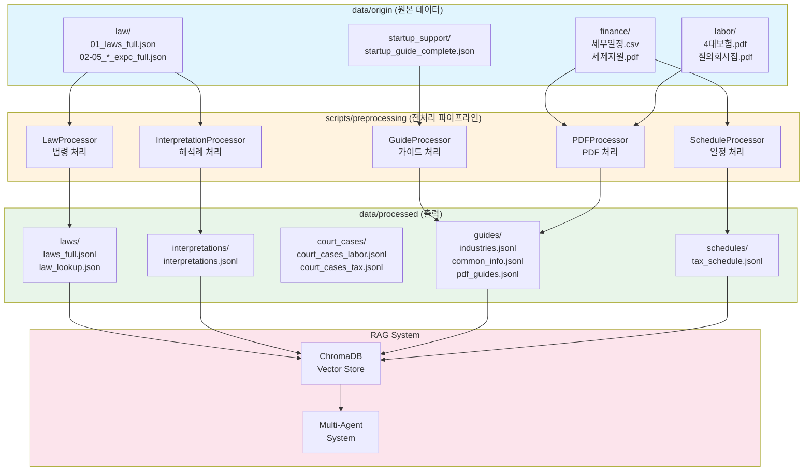
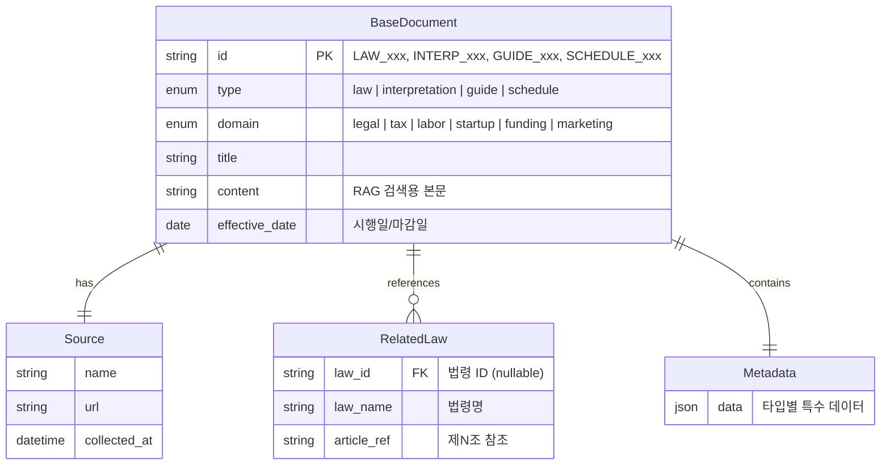
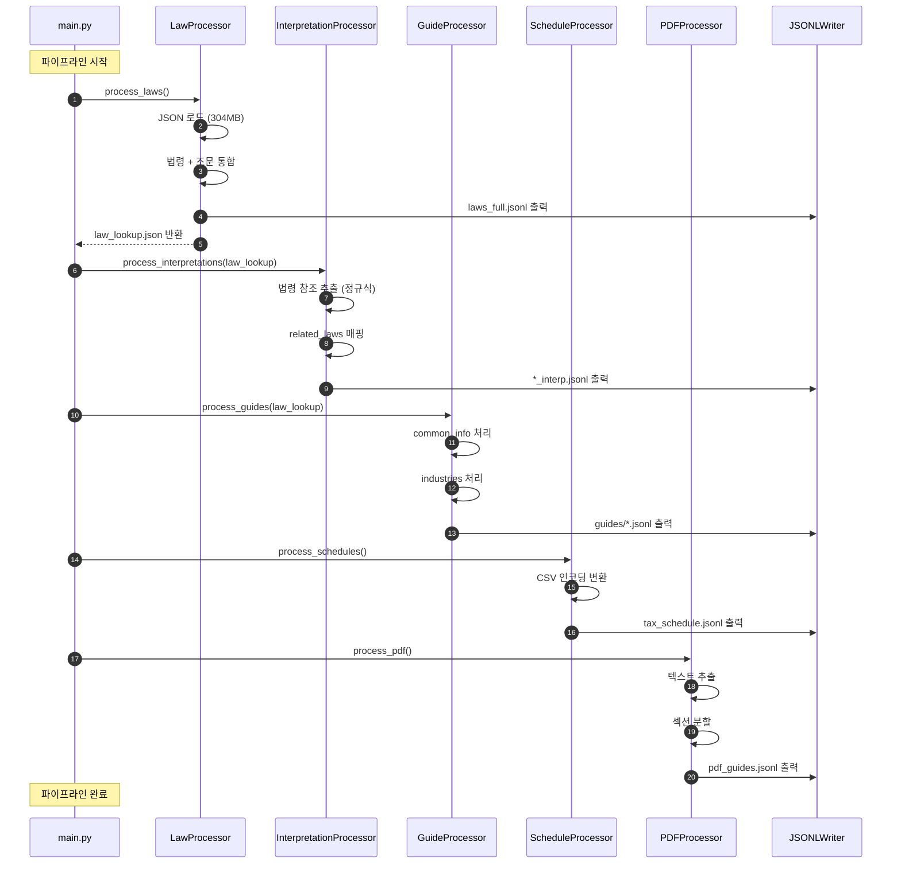
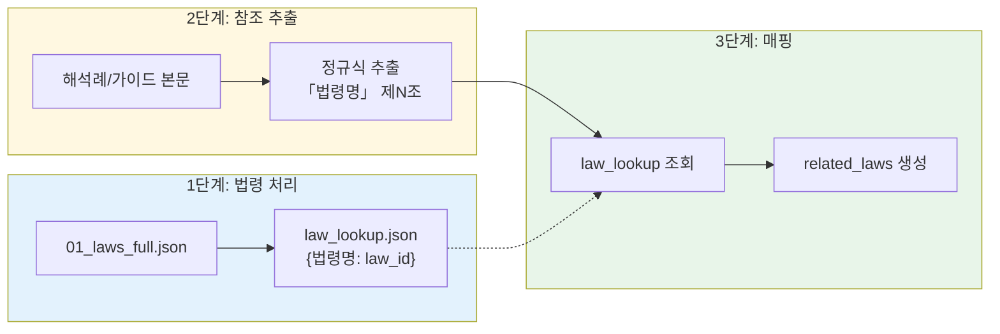
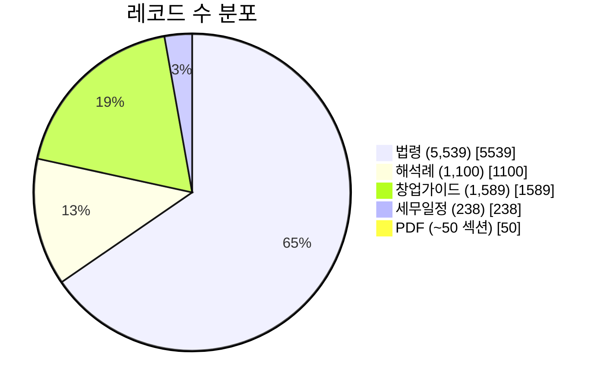
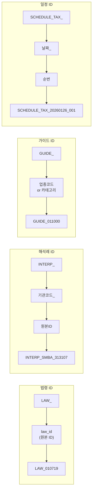
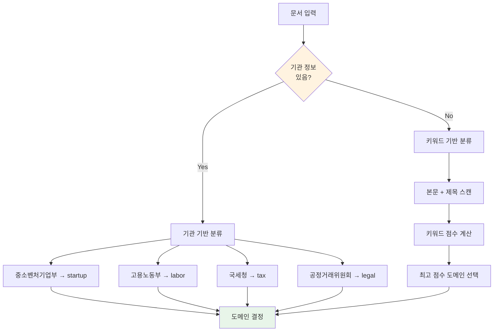
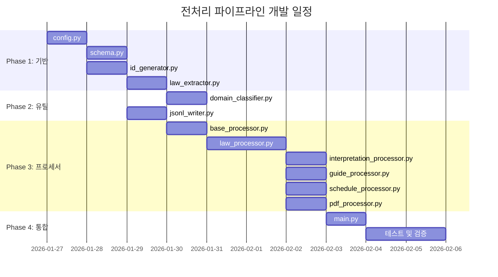
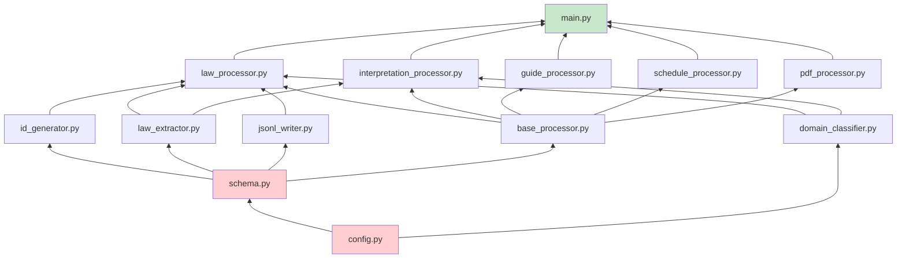

# BizMate 데이터 전처리 파이프라인

> 원본 데이터를 RAG 시스템에 적합한 통일 스키마로 변환하는 파이프라인

---

## 1. 시스템 개요

### 1.1 아키텍처 다이어그램



### 1.2 개발 원칙

| 원칙 | 설명 | 예시 |
|------|------|------|
| **하드코딩 금지** | 경로, 파일명, 상수값은 config.py에서 관리 | `OUTPUT_DIR = Path(config.OUTPUT_PATH)` |
| **모듈화** | 단일 책임 원칙, 재사용 가능한 함수/클래스 설계 | Processor별 독립 모듈, 공통 유틸 분리 |
| **설정 주입** | 외부 설정 파일(.env, config)을 통한 환경 분리 | `API_KEY = os.getenv("LAW_API_KEY")` |
| **의존성 명시** | 함수/클래스 간 의존 관계를 명확히 문서화 | 섹션 9.2 의존성 그래프 참조 |

---

## 2. 통일 스키마

### 2.1 스키마 구조 다이어그램



### 2.2 스키마 정의

```json
{
  "id": "LAW_010719",
  "type": "law",
  "domain": "legal",
  "title": "근로기준법",
  "content": "제1조(목적) 이 법은 헌법에 따라...",
  "source": {
    "name": "국가법령정보센터",
    "url": "https://law.go.kr/법령/근로기준법",
    "collected_at": "2026-01-20T11:43:48"
  },
  "effective_date": "2024-02-09",
  "metadata": {         # 필요한 경우 추가
    "ministry": "고용노동부",
    "enforcement_date": "20240209",
    "article_count": 116,
    "related_laws": []      
  }
}
```

---

## 3. 데이터 흐름

### 3.1 처리 순서 다이어그램



### 3.2 법령 참조 연결 흐름



---

## 4. 원본 데이터 분석

### 4.1 데이터 소스 현황



### 4.2 원본 → 출력 매핑

| 원본 파일 | 형식 | 크기 | 레코드 | 출력 파일 |
|-----------|------|------|--------|-----------|
| `law-raw/01_laws_full.json` | JSON | 304MB | 5,539 법령 | `final_files/data/processed/laws/laws_full.jsonl` |
| `law-raw/expc_전체.json` | JSON | 74MB | 8,604건 | `final_files/data/processed/interpretations/interpretations.jsonl` |
| `law-raw/prec_labor.json` | JSON | 20MB | 981건 | `final_files/data/processed/court_cases/court_cases_labor.jsonl` |
| `law-raw/prec_tax_accounting.json` | JSON | 25MB | 1,949건 | `final_files/data/processed/court_cases/court_cases_tax.jsonl` |
| `data/origin/startup_support/startup_guide_complete.json` | JSON | 3.5MB | 1,589 업종 | `data/processed/guides/industries.jsonl` |
| `data/origin/finance/국세청_세무일정_20260101.csv` | CSV | 20KB | 238건 | `data/processed/schedules/tax_schedule.jsonl` |
| `data/origin/finance/2025 중소기업세제·세정지원 제도.pdf` | PDF | 13MB | - | `data/processed/guides/pdf_guides.jsonl` |
| `data/origin/labor/[PDF]중소벤처기업 4대보험 신고.pdf` | PDF | 637KB | - | `data/processed/guides/pdf_guides.jsonl` |
| `data/origin/labor/근로기준법 질의회시집.pdf` | PDF | 13MB | - | `data/processed/guides/pdf_guides.jsonl` |

---

## 5. ID 체계

### 5.1 ID 생성 규칙



### 5.2 기관 코드 매핑

| 기관명 | 코드 | 도메인 |
|--------|------|--------|
| 중소벤처기업부 | SMBA | startup |
| 고용노동부 | LABOR | labor |
| 국세청 | NTS | tax |
| 공정거래위원회 | FTC | legal |

---

## 6. 도메인 분류

### 6.1 분류 로직



### 6.2 도메인별 키워드

| 도메인 | 키워드 |
|--------|--------|
| **tax** | 세법, 소득세, 법인세, 부가가치세, 국세청, 세금, 세무 |
| **labor** | 근로, 노동, 고용, 임금, 퇴직, 해고, 휴가, 4대보험 |
| **startup** | 사업자, 창업, 법인설립, 업종, 인허가 |
| **funding** | 지원사업, 보조금, 정책자금, 공고 |
| **legal** | 상법, 민법, 특허법, 상표법, 저작권법, 공정거래, 계약 |
| **marketing** | 광고, 홍보, 마케팅, 브랜딩 |

---

## 7. 법령 참조 추출

### 7.1 정규식 패턴

```python
# 법령명 추출
LAW_NAME_PATTERN = r"「([^」]+)」"
# 예: 「근로기준법」 → "근로기준법"

# 조문 참조 추출
ARTICLE_PATTERN = r"제(\d+)조(?:의(\d+))?"
# 예: "제15조" → ("15", None)
# 예: "제2조의3" → ("2", "3")

# 동법/같은 법 처리
SAME_LAW_PATTERN = r"(?:동법|같은\s*법)\s*제(\d+)조"
```

### 7.2 추출 예시

```
입력 텍스트:
"「근로기준법」 제15조 및 같은 법 제18조에 따라..."

추출 결과:
[
  {"law_name": "근로기준법", "law_id": "LAW_010719", "article_ref": "제15조"},
  {"law_name": "근로기준법", "law_id": "LAW_010719", "article_ref": "제18조"}
]
```

---

## 8. 파일 구조

### 8.1 디렉토리 트리

```
SKN20-FINAL-6TEAM/
├── scripts/
│   └── preprocessing/                 # 전처리 스크립트
│       ├── __init__.py
│       ├── config.py                  # 경로, 상수
│       ├── schema.py                  # Pydantic 스키마
│       ├── requirements.txt           # 의존성
│       ├── data_pipeline.md           # 이 문서
│       │
│       ├── utils/
│       │   ├── __init__.py
│       │   ├── id_generator.py        # ID 생성
│       │   ├── law_extractor.py       # 법령 참조 추출
│       │   └── domain_classifier.py   # 도메인 분류
│       │
│       ├── processors/
│       │   ├── __init__.py
│       │   ├── base_processor.py      # 추상 클래스
│       │   ├── law_processor.py       # 법령 처리
│       │   ├── interpretation_processor.py
│       │   ├── guide_processor.py
│       │   ├── schedule_processor.py
│       │   └── pdf_processor.py       # PDF 처리
│       │
│       ├── writers/
│       │   ├── __init__.py
│       │   └── jsonl_writer.py        # JSONL 출력
│       │
│       └── main.py                    # CLI 진입점
│
└── data/
    ├── origin/                        # 원본 데이터 (읽기 전용)
    │   ├── law/
    │   ├── startup_support/
    │   ├── finance/
    │   └── labor/
    │
    └── processed/                     # 전처리 출력
        ├── laws/
        │   ├── laws_full.jsonl
        │   └── law_lookup.json
        ├── interpretations/
        │   └── interpretations.jsonl
        ├── court_cases/
        │   ├── court_cases_labor.jsonl
        │   └── court_cases_tax.jsonl
        ├── guides/
        │   ├── common_info.jsonl
        │   ├── industries.jsonl
        │   └── pdf_guides.jsonl
        └── schedules/
            └── tax_schedule.jsonl
```

---

## 9. 구현 순서

### 9.1 개발 로드맵



### 9.2 의존성 그래프



---

## 10. 실행 방법

### 10.1 설치

```bash
cd C:\.workspace\SKN20-FINAL-6TEAM
pip install -r scripts/preprocessing/requirements.txt
```

### 10.2 CLI 명령어

```bash
# 전체 처리
python -m scripts.preprocessing.main --all

# 개별 처리
python -m scripts.preprocessing.main --laws           # 법령만
python -m scripts.preprocessing.main --interpretations # 해석례만
python -m scripts.preprocessing.main --guides         # 가이드만
python -m scripts.preprocessing.main --schedules      # 세무일정만
python -m scripts.preprocessing.main --pdf            # PDF만
```

### 10.3 출력 확인

```bash
# JSONL 파일 미리보기
head -3 data/processed/laws/laws_full.jsonl | jq .

# 레코드 수 확인
wc -l data/processed/*/*.jsonl

# 법령 lookup 확인
jq 'keys | length' data/processed/laws/law_lookup.json
```

---

## 11. 검증 체크리스트

### 11.1 스키마 검증
- [ ] 모든 JSONL 레코드가 Pydantic 스키마 통과
- [ ] 필수 필드(id, type, domain, title, content) 존재
- [ ] ID 형식 규칙 준수

### 11.2 관계 무결성
- [ ] `related_laws[].law_id`가 `law_lookup.json`에 존재
- [ ] 법령 해석례의 법령 참조가 올바르게 추출

### 11.3 데이터 품질
- [ ] 법령 수: ~5,500개
- [ ] 해석례 수: ~1,100개
- [ ] 가이드 수: ~1,600개
- [ ] 일정 수: ~240개
- [ ] 한글 인코딩 정상 (깨짐 없음)

### 11.4 성능
- [ ] 전체 처리 시간 < 15분
- [ ] 메모리 사용량 < 4GB

---

## 12. 의존성

### requirements.txt

```
pydantic>=2.0
PyPDF2>=3.0
chardet>=5.0
tqdm>=4.0
```

---

## 13. 참고 자료

- [프로젝트 CLAUDE.md](../../CLAUDE.md)
- [데이터 CLAUDE.md](../../data/CLAUDE.md)
