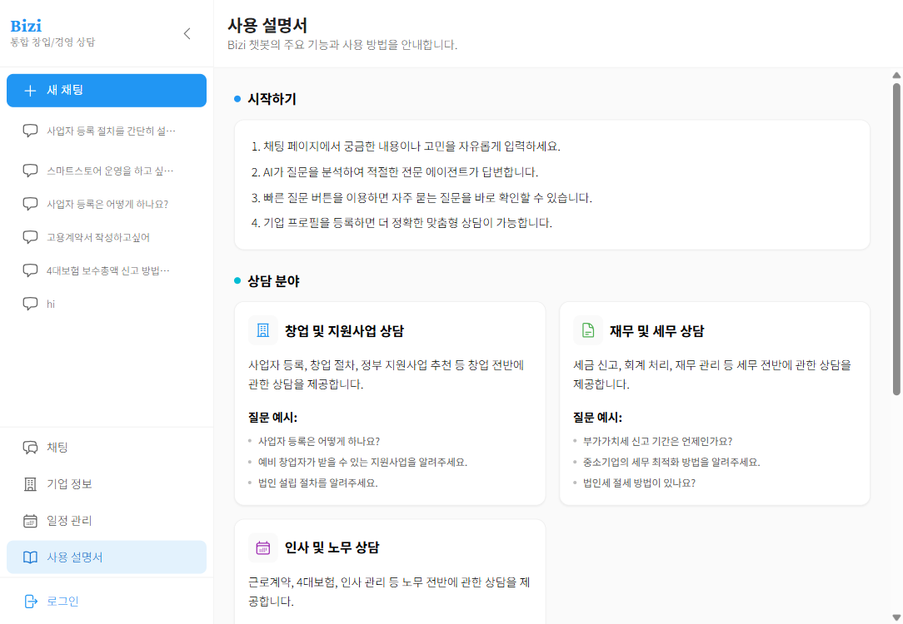
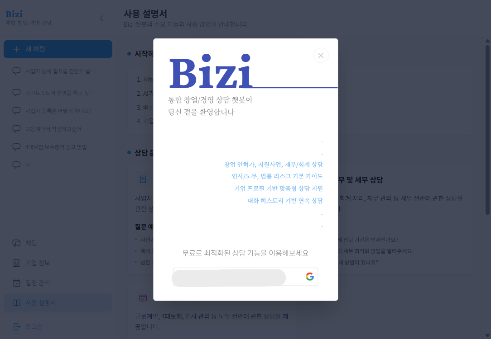
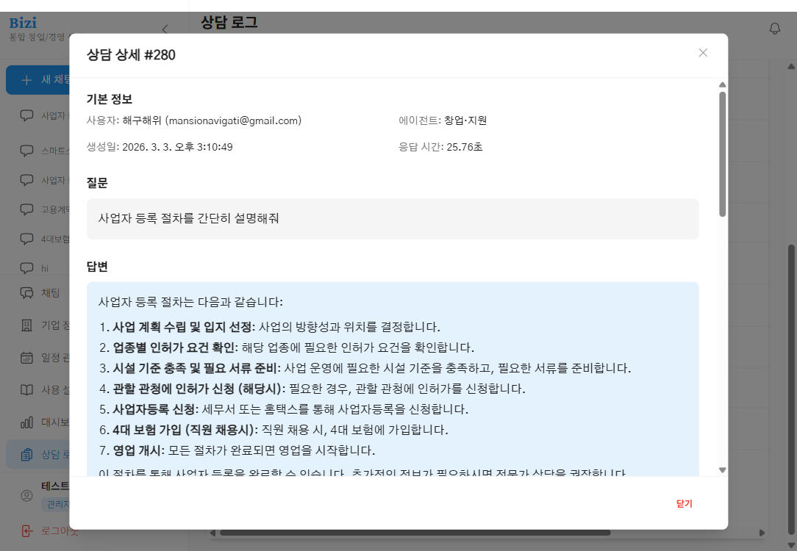

# 개발된 LLM 연동 웹 애플리케이션 산출물

- 프로젝트명: Bizi
- 서비스 성격: 통합 창업/경영 상담 챗봇
- 문서 유형: 개발 산출물
- 작성 기준: 현재 저장소의 실제 구현 코드 및 실행 설정 기준
- 작성일: 2026-03-04

---

## 산출물 목적

본 문서는 Bizi 프로젝트에 구현된 LLM 연동 웹 애플리케이션의 실제 기능, 서비스 구성, 실행 방법, 주요 코드 구조, 운영 시 유의사항을 정리한 개발 산출물이다. 문서 내용은 `frontend/`, `backend/`, `rag/`, `docker-compose*.yaml`, `nginx*.conf`에 존재하는 현재 구현 상태를 기준으로 정리하였다.

---

## 개요

### 목표

- 4개 전문 도메인에 대한 검색 기반 상담 제공
- 벡터 검색과 LLM 응답 생성을 결합한 RAG 구조 구현
- 사용자/기업 정보를 반영한 맞춤형 상담 흐름 제공
- 인증, 일정, 알림, 문서 생성, 관리자 기능을 포함한 웹 서비스 형태로 통합

### 구현 완료 기능

- AI 상담
  - 메인 채팅 화면에서 비스트리밍/스트리밍(SSE) 답변 제공
  - 응답 출처(source)와 액션 버튼 함께 표시
  - 멀티 세션 채팅 이력 관리
- 멀티 도메인 RAG
  - 창업/지원사업
  - 재무/세무
  - 인사/노무
  - 법률
- 사용자 접근 방식
  - Google OAuth2 로그인
  - JWT(HttpOnly Cookie) 기반 세션 유지
  - 비로그인 게스트 상담 10회 제한
  - 로그인 시 게스트 대화 이력 동기화
- 기업 정보 관리
  - 기업 등록/수정/대표 기업 설정
  - 대표 기업 기준 사용자 컨텍스트를 RAG에 주입
- 일정 및 공고 연동
  - 일정 CRUD
  - 공고 기반 일정 자동 등록/제거
  - 공고 메모와 사용자 메모 병합 저장
- 알림 기능
  - D-7 일정 알림
  - D-3 일정 알림
  - 신규 공고 알림
  - 답변 완료 알림
  - 사용자별 알림 설정 저장
- 문서 생성 기능
  - 표준 근로계약서 생성
  - 사업계획서 생성
  - 범용 문서 생성 및 수정
  - 현재 레지스트리 기준 총 9개 문서 유형 지원
- 관리자 기능
  - 서버 상태 조회
  - 리소스 메트릭 조회
  - 스케줄러 실행 이력 조회
  - 백엔드/RAG 로그 조회
  - 상담 이력 목록/상세/평가 통계 조회

### 기술 스택

| 영역 | 기술 |
|---|---|
| Frontend | React 18, Vite, TypeScript, TailwindCSS, React Router, Zustand, Axios, TanStack Query, Material Tailwind |
| Backend | FastAPI, SQLAlchemy 2.0, PyJWT, Google OAuth2, SlowAPI |
| RAG Service | FastAPI, LangChain, LangGraph, OpenAI GPT-4o-mini, RAGAS(옵션) |
| Vector DB | ChromaDB |
| Database | MySQL 8.0 (`bizi_db`) |
| Infra | Docker Compose, Nginx Reverse Proxy, SSH Tunnel(Bastion -> AWS RDS) |

---

## 시스템 구성 및 실행

### 1) 실행 전 준비

- Docker / Docker Compose 사용 가능 환경
- 프로젝트 루트 `.env` 파일 준비 (`.env.example` 기반)
- `.ssh/bizi-key.pem` 준비
- `BASTION_HOST`, `MYSQL_HOST`, `MYSQL_USER`, `MYSQL_PASSWORD`, `MYSQL_DATABASE` 설정
- Google 로그인 사용 시 `GOOGLE_CLIENT_ID`, `GOOGLE_CLIENT_SECRET` 설정
- 실제 RAG 서비스 사용 시 `OPENAI_API_KEY` 설정
- 필요 시 `RAG_API_KEY`, `ADMIN_API_KEY`, `RUNPOD_API_KEY`, `RUNPOD_ENDPOINT_ID` 설정

### 2) 핵심 환경 변수

```bash
cp .env.example .env
```

주요 점검 항목:

| 구분 | 변수 | 설명 |
|---|---|---|
| DB/SSH | `MYSQL_HOST`, `MYSQL_PORT`, `MYSQL_DATABASE`, `MYSQL_USER`, `MYSQL_PASSWORD`, `BASTION_HOST` | AWS RDS 접속과 SSH 터널 설정 |
| 인증 | `JWT_SECRET_KEY`, `COOKIE_SECURE`, `COOKIE_SAMESITE` | JWT 쿠키 발급 및 보안 옵션 |
| Google 로그인 | `GOOGLE_CLIENT_ID`, `GOOGLE_CLIENT_SECRET` | 프론트/백 인증 연동 |
| RAG 공통 | `OPENAI_API_KEY`, `RAG_API_KEY`, `ADMIN_API_KEY` | RAG 응답 생성 및 내부 인증 |
| 벡터 검색 | `CHROMA_HOST`, `CHROMA_PORT`, `CHROMA_AUTH_TOKEN` | ChromaDB 접속 |
| 임베딩 | `EMBEDDING_PROVIDER`, `RUNPOD_API_KEY`, `RUNPOD_ENDPOINT_ID` | `local` 또는 `runpod` |
| 검색 토글 | `ENABLE_HYBRID_SEARCH`, `ENABLE_RERANKING`, `ENABLE_LLM_EVALUATION`, `ENABLE_RAGAS_EVALUATION` | RAG 파이프라인 동작 제어 |
| 세션 메모리 | `SESSION_MEMORY_BACKEND`, `REDIS_URL` | `memory` 또는 `redis` |
| 개발 편의 | `ENABLE_TEST_LOGIN` | 테스트 로그인 API 허용 여부 |

### 3) 실행 모드

| 구분 | 실행 명령 | 실제 구성 |
|---|---|---|
| 로컬 개발 모드 | `docker compose -f docker-compose.local.yaml up --build` | `nginx + frontend + backend + ssh-tunnel + mock-rag` |
| 통합 RAG 모드 | `docker compose up --build` | `nginx + frontend + backend + ssh-tunnel + rag + chromadb` |

정리:

- 로컬 개발 모드는 현재 코드 기준으로 `mock-rag`를 사용한다.
- 통합 RAG 모드는 실제 `rag` 서비스와 `chromadb`를 함께 사용한다.
- 두 모드 모두 현재 Compose 설정상 AWS RDS 연결을 위한 SSH 터널 구성이 포함되어 있다.

### 4) 접근 경로

- 사용자 진입점: `http://localhost`
- Backend 프록시 경로: `http://localhost/api/*`
- RAG 직접 프록시 경로: `http://localhost/rag/*`
- 컨테이너 내부 포트
  - frontend: `5173`
  - backend: `8000`
  - rag/mock-rag: `8001`
  - chromadb: `8000` (통합 RAG 모드에서 사용)

브라우저 기준 주요 요청 흐름:

- 일반 웹 사용자는 주로 `http://localhost/api/*` 경로를 통해 Backend를 사용한다.
- `http://localhost/rag/*` 경로는 통합 테스트나 직접 헬스체크, RAG 직접 접근 용도로 활용할 수 있다.

---

## 주요 구현 내용

### 1) 게이트웨이 및 서비스 연결

- Nginx가 단일 외부 진입점 역할을 수행한다.
- 라우팅 규칙
  - `/api/*` -> Backend
  - `/rag/*` -> RAG 또는 mock-rag
  - `/*` -> Frontend
- SSE 스트리밍을 위해 `proxy_buffering off`, `proxy_read_timeout` 등이 설정되어 있다.
- CSP, `X-Frame-Options`, `X-Content-Type-Options`, rate limiting 설정이 포함되어 있다.

관련 파일:

- `nginx.conf`
- `nginx.local.conf`
- `docker-compose.yaml`
- `docker-compose.local.yaml`

### 2) Frontend UI 및 상태 관리

- 라우트 구성: `frontend/src/App.tsx`
  - `/` 메인 채팅
  - `/guide` 사용 가이드
  - `/company` 기업 정보 관리
  - `/schedule` 일정 관리
  - `/admin` 관리자 대시보드
  - `/admin/log` 관리자 상담 로그
  - `/login` 로그인 모달 오픈용 라우트
- 인증 상태: `frontend/src/stores/authStore.ts`
  - 로그인/로그아웃 처리
  - 인증 확인(`checkAuth`)
  - 로그인 후 게스트 메시지 동기화
  - 알림 설정 로딩
- 채팅 상태: `frontend/src/stores/chatStore.ts`
  - 멀티 세션 대화 저장
  - 게스트 메시지 카운트 관리
  - DB 이력 + 활성 세션 부트스트랩
- 알림 상태: `frontend/src/stores/notificationStore.ts`
  - 읽음/안읽음
  - 토스트 큐 관리
- 채팅 흐름 훅: `frontend/src/hooks/useChat.ts`
  - 게스트 10회 제한
  - SSE 스트리밍 수신
  - source/action/done 이벤트 반영
  - 답변 완료 알림 생성
- 알림 훅: `frontend/src/hooks/useNotifications.ts`
  - 일정 종료일 기준 D-7/D-3 알림 생성
- 채팅 UI
  - `SourceReferences.tsx`: 출처 링크 표시
  - `ActionButtons.tsx`: 문서 생성 등 액션 버튼 렌더링
  - `ContractFormModal.tsx`, `DocumentFormModal.tsx`: 문서 생성 UI

### 3) Backend API 및 보안/운영 처리

- 진입점: `backend/main.py`
- 등록 라우터
  - `auth`
  - `users`
  - `companies`
  - `histories`
  - `schedules`
  - `admin`
  - `rag`
  - `announces`
- 인증 구조
  - `POST /auth/google`
  - `POST /auth/logout`
  - `POST /auth/refresh`
  - `GET /auth/me`
  - 개발 환경에서 `POST /auth/test-login` 사용 가능
- 사용자 기능
  - 사용자 정보 조회/수정
  - 사용자 유형 변경
  - 알림 설정 조회/수정
- 상담 이력 기능
  - `GET /histories`
  - `POST /histories`
  - `GET /histories/{history_id}`
  - `GET /histories/threads`
  - `GET /histories/threads/{root_history_id}`
  - DB 이력과 활성 세션 이력 병합
- 관리자 기능
  - `GET /admin/metrics`
  - `GET /admin/scheduler/status`
  - `GET /admin/logs`
  - `GET /admin/status`
  - `GET /admin/histories`
  - `GET /admin/histories/stats`
  - `GET /admin/histories/{history_id}`
- 운영/보안 요소
  - CSRF 보호 미들웨어
  - 요청별 `X-Request-ID` 발급
  - 구조화 감사 로그
  - 민감정보 마스킹 필터
  - SlowAPI 기반 rate limiting

### 4) Backend의 RAG 프록시 역할

- 경로: `backend/apps/rag/router.py`
- 기능
  - `POST /rag/chat`
  - `POST /rag/chat/stream`
  - `POST /rag/documents/contract`
  - `POST /rag/documents/business-plan`
  - `POST /rag/documents/generate`
  - `POST /rag/documents/modify`
  - `GET /rag/documents/types`
  - `GET /rag/health`
- 인증 사용자의 대표 기업 정보와 사용자 유형을 조회해 `user_context`로 RAG에 전달한다.
- `session_id`가 있으면 세션 기반 대화 흐름을 RAG에 전달한다.
- 스트리밍 응답은 Backend가 SSE를 그대로 중계한다.

### 5) RAG 파이프라인 구현

- 진입점: `rag/main.py`
- 주요 채팅 엔드포인트: `rag/routes/chat.py`
  - `POST /api/chat`
  - `POST /api/chat/stream`
  - `DELETE /api/chat/sessions/{session_id}`
- 활성 세션 조회: `rag/routes/sessions.py`
  - `GET /api/sessions/active`
- 파이프라인 단계
  1. 질문 정제 및 프롬프트 인젝션 검사
  2. 질문 분류(classify)
  3. 질문 분해(decompose)
  4. 문서 검색(retrieve)
  5. 응답 생성(generate)
  6. 평가(evaluate)
- 스트리밍 이벤트 유형
  - `token`
  - `source`
  - `action`
  - `done`
  - `error`
- 세션 처리
  - `session_id` 기반 멀티턴 히스토리 유지
  - 설정값에 따라 `memory` 또는 `redis` 백엔드 사용
- 품질 관련 기능
  - 응답 캐시
  - Hybrid Search
  - Re-ranking
  - Query rewrite / Multi-query
  - LLM 평가
  - RAGAS 평가(옵션)

### 6) 벡터 스토어 및 도메인 데이터 구성

- 설정 파일: `rag/vectorstores/config.py`
- 컬렉션 구성
  - `startup_funding_db`
  - `finance_tax_db`
  - `hr_labor_db`
  - `law_common_db`
- ChromaDB에는 도메인별 컬렉션이 저장되며, 검색 시 도메인 분류 결과에 따라 해당 컬렉션을 우선 탐색한다.

### 7) 일정, 공고, 알림 연동

- 일정 API: `backend/apps/schedules/router.py`
  - 목록 조회, 생성, 수정, 삭제
- 공고 API: `backend/apps/announces/router.py`
  - `GET /announces`
  - `POST /announces/sync`
  - 로그인/로그아웃 시 신규 공고 알림 동기화
- 프론트 연동 화면: `frontend/src/pages/SchedulePage.tsx`
  - 공고 `+` 클릭 시 일정 생성
  - 공고 `-` 클릭 시 연동 일정 제거
  - 자동 등록 메모와 사용자 메모를 함께 관리
- 알림 설정 API: `backend/apps/users/router.py`
  - `GET /users/me/notification-settings`
  - `PUT /users/me/notification-settings`
- 현재 지원 알림 유형
  - `schedule_d7`
  - `schedule_d3`
  - `new_announce`
  - `answer_complete`

### 8) 문서 생성 기능

- 프런트 진입점
  - `frontend/src/components/chat/ActionButtons.tsx`
  - `frontend/src/components/chat/ContractFormModal.tsx`
  - `frontend/src/components/chat/DocumentFormModal.tsx`
- 백엔드 프록시
  - `POST /rag/documents/contract`
  - `POST /rag/documents/business-plan`
  - `POST /rag/documents/generate`
  - `POST /rag/documents/modify`
  - `GET /rag/documents/types`
- 문서 유형 레지스트리: `rag/agents/document_registry.py`
- 현재 문서 유형
  1. `labor_contract`
  2. `business_plan`
  3. `nda`
  4. `service_agreement`
  5. `cofounder_agreement`
  6. `investment_loi`
  7. `mou`
  8. `privacy_consent`
  9. `shareholders_agreement`
- 출력 형식
  - 근로계약서: PDF / DOCX
  - 사업계획서: PDF / DOCX
  - 범용 문서 생성: PDF / DOCX
  - 문서 수정 API도 지원

### 9) 프롬프트 및 품질 최적화 포인트

- 프롬프트 정의: `rag/utils/prompts.py`
- 주요 프롬프트
  - `STARTUP_FUNDING_PROMPT`
  - `FINANCE_TAX_PROMPT`
  - `HR_LABOR_PROMPT`
  - `LEGAL_PROMPT`
  - `MULTI_DOMAIN_SYNTHESIS_PROMPT`
  - `QUESTION_DECOMPOSER_PROMPT`
  - `MULTI_QUERY_PROMPT`
- 프롬프트 안전성: `rag/utils/sanitizer.py`
  - 입력 정제
  - 패턴 탐지
  - `PROMPT_INJECTION_GUARD` 결합
- 주요 튜닝 변수 예
  - `ENABLE_HYBRID_SEARCH`
  - `ENABLE_RERANKING`
  - `VECTOR_SEARCH_WEIGHT`
  - `MULTI_QUERY_COUNT`
  - `RERANKER_TYPE`
  - `ENABLE_VECTOR_DOMAIN_CLASSIFICATION`
  - `ENABLE_LLM_DOMAIN_CLASSIFICATION`
  - `SESSION_MEMORY_BACKEND`

---

## 기본 사용 시나리오

### 1) 비로그인 사용자가 상담 시작

1. `http://localhost` 접속
2. 메인 채팅 입력창에 질문 입력
3. 스트리밍 답변과 출처 표시 확인
4. 게스트 상태에서는 최대 10회까지 질문 가능
5. 제한 초과 시 로그인 안내 메시지 출력

### 2) 로그인 후 정식 상담 전환

1. `/login` 또는 로그인 모달 진입
2. Google 로그인 수행
3. 로그인 완료 후 인증 상태 확인
4. 기존 게스트 대화가 서버 이력과 동기화되는지 확인
5. 신규 공고 알림 동기화 여부 확인

### 3) 기업 정보 기반 맞춤 상담

1. `기업 정보` 화면에서 기업 등록
2. 대표 기업(`main_yn`) 설정
3. 메인 채팅으로 복귀해 동일 질문 재요청
4. 기업 업종/지역 등 사용자 컨텍스트가 반영된 응답 확인

### 4) 일정 및 공고 연동 사용

1. `일정 관리` 화면 진입
2. 기업 선택 후 관련 공고 목록 확인
3. 공고 `+` 버튼으로 일정 자동 등록
4. 등록된 일정에서 메모와 일정 정보 확인
5. 일정 종료일 기준 D-7 / D-3 알림 생성 여부 확인

### 5) 관리자 기능 사용

1. 관리자 권한 계정으로 로그인
2. `/admin`에서 서버 상태 및 리소스 차트 확인
3. 스케줄러 실행 이력과 로그 뷰어 확인
4. `/admin/log`에서 상담 이력 목록과 상세 정보 확인

### 6) 문서 생성 사용

1. 채팅 응답 하단 액션 버튼 확인
2. 인증 상태에서 문서 생성 버튼 클릭
3. 근로계약서 또는 범용 문서 폼 입력
4. PDF / DOCX 다운로드 성공 여부 확인

---

## 사용자 이용 흐름

본 항목은 2026-03-04에 `http://localhost` 실제 서비스에 MCP Playwright 브라우저로 접속하여 확인한 결과를 정리한 것이다. 비로그인 흐름은 게스트 세션에서, 보호 페이지와 관리자 페이지 흐름은 실제 브라우저 세션에서 인증 쿠키를 부여한 뒤 확인하였다. 따라서 아래 내용은 코드 추정이 아니라 실제 화면을 근거로 정리한 사용자 이용 흐름이다.

| 번호 | 이용 흐름 | 접근 경로 | 인증 상태 | 실제 확인 결과 | 캡처 파일 |
|---|---|---|---|---|---|
| 1 | 게스트 상담 시작 및 답변 근거 확인 | `/` | 비로그인 | 빠른 질문, 채팅 입력창, 답변 근거 링크, 외부 이동 버튼 확인 | `01-guest-main-chat.png` |
| 2 | 사용 설명서 확인 | `/guide` | 비로그인 | 시작하기, 상담 분야, FAQ 영역 노출 확인 | `02-usage-guide.png` |
| 3 | 보호 페이지 접근 시 로그인 유도 | `/company` 진입 시도 | 비로그인 | 로그인 모달 자동 노출 확인 | `03-protected-route-login-modal.png` |
| 4 | 로그인 후 기업 정보 화면 확인 | `/company` | 로그인 | 기업 목록, 빈 상태 안내, 기업 대시보드 영역 확인 | `04-company-page.png` |
| 5 | 기업 등록 폼 진입 | `/company` > `기업 추가` | 로그인 | 기업 상태, 회사명, 업종, 주소, 시작일 입력 폼 확인 | `09-company-registration-form.png` |
| 6 | 일정 관리 화면 확인 | `/schedule` | 로그인 | 기업 단위 일정 관리 안내, 캘린더, 관련 공고 영역 확인 | `05-schedule-page.png` |
| 7 | 채팅 내 문서 생성 액션 버튼 확인 | `/` | 로그인 | 문서 요청 후 `근로계약서 생성` 버튼 노출 확인 | `08-chat-action-button.png` |
| 8 | 관리자 대시보드 확인 | `/admin` | 관리자 | 상담 통계, 리소스 모니터링, 스케줄러 이력, 실시간 로그 확인 | `06-admin-dashboard.png` |
| 9 | 관리자 상담 로그 상세 확인 | `/admin/log` | 관리자 | 상담 상세 모달, 질문/답변, LLM 평가, 검색 문서 정보 확인 | `07-admin-log-detail.png` |

### 1) 게스트 상담 시작 및 답변 근거 확인

- 메인 채팅 화면에서 빠른 질문 버튼과 입력창이 정상 노출되었고, 답변 하단에 `답변 근거 4건`과 외부 이동 버튼이 함께 표시되는 것을 확인하였다.
- 이는 비로그인 상태에서도 기본 상담과 출처 기반 응답 확인이 가능함을 보여준다.


### 2) 사용 설명서 확인

- `사용 설명서` 페이지에서 시작하기 안내, 상담 분야 카드, FAQ 아코디언이 하나의 화면 흐름으로 제공되는 것을 확인하였다.
- 별도 로그인 없이 기능 이해와 질문 예시를 확인할 수 있는 구조임을 실제 화면으로 검증하였다.



### 3) 보호 페이지 접근 시 로그인 유도

- 비로그인 상태에서 `기업 정보` 메뉴에 접근하면 콘텐츠 대신 로그인 모달이 즉시 노출되는 것을 확인하였다.
- 이는 보호 페이지 접근 제어가 프런트 화면 레벨에서 사용자에게 명확히 안내된다는 점을 보여준다.



### 4) 로그인 후 기업 정보 확인

- 로그인 후 `기업 정보` 화면에서는 기업 목록, `기업 추가` 버튼, 선택 기업 대시보드 영역이 함께 노출되었다.
- 등록 기업이 없는 경우에도 다음 행동이 분명하게 드러나는 빈 상태 UX를 실제 화면으로 확인하였다.


### 5) 기업 등록 폼 진입

- `기업 추가` 버튼을 클릭하면 기업 상태, 회사명, 사업자등록번호, 업종, 주소, 사업 시작 예정일을 입력하는 등록 폼이 모달로 열리는 것을 확인하였다.
- 따라서 기업 등록 흐름은 별도 페이지 이동 없이 즉시 입력 가능한 모달 기반 UX로 구현되어 있다.


### 6) 일정 관리 화면 확인

- `일정 관리` 화면에서는 기업 선택 드롭다운, 캘린더/리스트 전환, 일정 추가 버튼, 관련 공고 영역이 함께 노출되었다.
- 기업이 아직 등록되지 않은 경우 `먼저 기업 정보를 등록해주세요` 안내 문구가 표시되어 일정 기능이 기업 단위로 동작함을 실제 화면으로 확인하였다.


### 7) 채팅 내 문서 생성 액션 버튼 확인

- 채팅창에서 `근로계약서 초안 작성해줘`를 입력한 뒤, 응답 하단에 `근로계약서 생성` 액션 버튼이 실제로 노출되는 것을 확인하였다.
- 이는 문서 생성 기능이 별도 메뉴가 아니라 상담 응답 흐름 안에서 직접 이어지도록 연결되어 있음을 보여준다.


### 8) 관리자 대시보드 확인

- 관리자 계정으로 진입 시 `대시보드` 화면에서 전체 상담 수, 평가 통계, 도메인별 상담 수, 리소스 모니터링, 스케줄러 실행 이력, 실시간 로그가 한 화면에 제공되는 것을 확인하였다.
- 운영 상태와 품질 지표를 함께 볼 수 있는 관리자 전용 모니터링 흐름이 실제로 구현되어 있음을 검증하였다.


### 9) 관리자 상담 로그 상세 확인

- `상담 로그` 목록에서 특정 행을 선택하면 상세 모달이 열리고, 질문/답변 전문, LLM 평가, 검색된 문서, 검색 평가 정보가 함께 표시되는 것을 확인하였다.
- 이는 관리자 화면에서 개별 상담 품질과 검색 근거를 사후 점검할 수 있음을 보여준다.



---

## 검증 및 확인 방법

### 1) 2026-03-03 기준 스모크 검증 결과

본 산출물 작성 과정에서 실제 저장소 기준으로 다음 검증을 수행하였다.

| 구분 | 검증 항목 | 결과 | 비고 |
|---|---|---|---|
| 정적 검증 | `cd frontend && npm run build` | 성공 | 프로덕션 빌드 완료 |
| 컨테이너 상태 확인 | `docker compose ps` | 성공 | 검증 시점 기준 주요 서비스 정상 기동 확인 |
| E2E 스모크 | `frontend/e2e/docker-smoke.spec.ts` | 성공 | 5건 전부 통과 |
| 런타임 헬스체크 | `http://localhost/api/health` | 성공 | Backend 정상 응답 확인 |
| 런타임 헬스체크 | `http://localhost/rag/health` | 성공 | RAG 정상 응답 확인 |

검증 결과 해석:

- 프런트엔드 소스는 현재 시점 기준 프로덕션 빌드가 가능함을 확인하였다.
- 웹 진입, 로그인 화면 노출, Backend 헬스체크, RAG 헬스체크, 메인 채팅 입력창 확인이 모두 통과하였다.
- 따라서 현재 실행 검증 결과는 Frontend, Backend, RAG, Nginx가 포함된 통합 실행 경로 기준 기본 스모크 테스트를 통과한 상태로 기록한다.

### 2) 2026-03-04 기준 MCP 실제 화면 확인

| 구분 | 확인 항목 | 결과 | 비고 |
|---|---|---|---|
| 실제 브라우저 UI | 게스트 상담, 사용 설명서, 보호 페이지 로그인 유도, 기업 정보, 기업 등록 폼, 일정 관리, 문서 생성 액션 버튼, 관리자 대시보드, 관리자 상담 로그 상세 | 성공 | MCP Playwright 기준 9개 흐름 확인 및 캡처 이미지 첨부 |

추가 확인 사항:

- 게스트 메인 상담 화면에서 답변 근거 링크와 외부 이동 버튼을 실제로 확인하였다.
- 보호 페이지는 비로그인 상태에서 로그인 모달로 유도되는 것을 확인하였다.
- 인증 이후 `기업 정보`, `일정 관리`, `관리자 대시보드`, `관리자 상담 로그` 화면이 실제로 열리는 것을 확인하였다.
- 채팅 응답 흐름 안에서 `근로계약서 생성` 액션 버튼이 노출되는 것을 확인하였다.

### 3) 수동 확인 항목

- Nginx 단일 진입점으로 서비스가 정상 노출되는지 확인
- Google 로그인 후 쿠키 기반 인증이 유지되는지 확인
- 게스트 10회 제한과 로그인 후 동기화 흐름 확인
- 메인 채팅의 SSE 스트리밍 응답 확인
- 출처(source)와 액션 버튼이 응답과 함께 표시되는지 확인
- 대표 기업 설정 후 응답 문맥이 달라지는지 확인
- 일정/공고/알림 연동이 정상 동작하는지 확인
- 관리자 페이지에서 상태/로그/통계 조회가 가능한지 확인
- 문서 생성 다운로드가 정상 동작하는지 확인

### 4) 저장소에서 확인된 자동화 자산

- Frontend E2E 스모크 테스트
  - 파일: `frontend/e2e/docker-smoke.spec.ts`
  - 확인 항목: 프런트 로딩, 로그인 페이지 노출, Backend 헬스체크, RAG 헬스체크, 채팅 입력창 존재
- RAG 테스트 스위트
  - 경로: `rag/tests/`
  - 예: API, cache, domain classifier, evaluator, reranker, retrieval, session memory 등

### 4) 대표 실행 명령

```bash
docker compose -f docker-compose.local.yaml up --build
docker compose up --build
cd frontend && npm run test:e2e
.venv\Scripts\pytest rag/tests/ -v
```

---

## 운영 시 유의사항

- 현재 로컬 Compose는 `mock-rag` 기반이므로 실제 RAG 품질 검증과는 분리해서 해석해야 한다.
- 현재 두 Compose 모두 SSH 터널을 통해 AWS RDS에 연결하도록 구성되어 있다.
- Docker 기반 스모크 테스트를 수행하려면 Docker Desktop 또는 Docker daemon이 먼저 실행 중이어야 한다.
- `EMBEDDING_PROVIDER` 값에 따라 임베딩 경로가 `local` 또는 `runpod`로 바뀐다.
- `ENABLE_*` 토글에 따라 검색, 재정렬, 평가, 캐시, 세션 메모리 동작이 달라진다.
- 브라우저에서 사용하는 주 경로는 `/api/*`이며, 실제 채팅은 Backend의 `/api/rag/*` 프록시를 통해 흐른다.
- `/rag/*` 경로는 직접 헬스체크 또는 통합 확인용으로 사용할 수 있다.
- 로그인 UI는 Google 로그인 중심이며, `test-login`은 개발용 API 엔드포인트다.
- `notification_settings`는 사용자별 알림 정책을 저장하므로, 알림 테스트 시 설정값 상태를 함께 확인해야 한다.

---

## 확장 및 커스터마이징

### 1) 도메인 확장

1. 도메인 코드 및 설정 추가
2. 전처리 데이터 수집 및 컬렉션 구성 추가
3. RAG 에이전트 및 프롬프트 추가
4. 도메인 분류 및 검색 라우팅 규칙 반영

### 2) 검색 전략 커스터마이징

- `VECTOR_SEARCH_WEIGHT` 조정
- `ENABLE_HYBRID_SEARCH` / `ENABLE_RERANKING` 조합 조정
- `MULTI_QUERY_COUNT` 및 reranker 설정 변경
- 세션 메모리 백엔드 변경(`memory` / `redis`)

### 3) UI/UX 커스터마이징

- `MainPage.tsx`의 채팅 경험 개선
- `SchedulePage.tsx`의 공고 연동 UX 수정
- `ProfileDialog.tsx`에서 알림 설정 항목 확장
- `Sidebar.tsx`, `LoginPage.tsx` 기반 브랜딩 조정

### 4) 운영/관측성 확장

- 관리자 메트릭 항목 추가
- 로그 수집 파이프라인 연동
- 스케줄러 작업 이력 확장
- RAG 품질 평가 지표 대시보드 고도화

---

## 결론

### 성과

- LLM, RAG, 벡터 DB, 웹 UI, 인증, 일정, 알림, 관리자 기능을 단일 서비스 흐름으로 통합 구현하였다.
- 사용자/기업 컨텍스트를 반영하는 상담 구조와 멀티 세션 채팅 흐름을 구현하였다.
- 문서 생성, 공고 연동 일정, 운영 로그/메트릭 조회까지 포함하는 서비스 구조를 확보하였다.
- 2026-03-03 기준 통합 컨테이너 환경에서 기본 스모크 테스트 5건을 모두 통과하였다.
- 2026-03-04 기준 MCP Playwright로 주요 사용자 이용 흐름 9건을 실제 화면과 함께 확인하였다.

### 후속 보완 가능 항목

- 통합 RAG 모드 기준 성능 및 품질 회귀 검증 자동화 강화가 필요하다.
- 세션 메모리의 운영 환경 최적화와 관리자용 품질 모니터링 지표 확장이 가능하다.
- 문서 유형 추가 및 템플릿 정교화를 통해 활용 범위를 확대할 수 있다.

---

## 참고 파일

- `frontend/src/App.tsx`
- `frontend/src/stores/authStore.ts`
- `frontend/src/stores/chatStore.ts`
- `frontend/src/hooks/useChat.ts`
- `frontend/src/hooks/useNotifications.ts`
- `frontend/src/pages/MainPage.tsx`
- `frontend/src/pages/SchedulePage.tsx`
- `frontend/src/pages/AdminDashboardPage.tsx`
- `frontend/src/pages/AdminLogPage.tsx`
- `frontend/src/components/chat/ActionButtons.tsx`
- `frontend/src/components/chat/ContractFormModal.tsx`
- `frontend/src/components/chat/DocumentFormModal.tsx`
- `frontend/e2e/docker-smoke.spec.ts`
- `산출물/7주차/images/user-flows/`
- `backend/main.py`
- `backend/apps/rag/router.py`
- `backend/apps/histories/router.py`
- `backend/apps/users/router.py`
- `backend/apps/admin/router.py`
- `backend/apps/schedules/router.py`
- `backend/apps/announces/router.py`
- `rag/main.py`
- `rag/routes/chat.py`
- `rag/routes/sessions.py`
- `rag/utils/prompts.py`
- `rag/utils/sanitizer.py`
- `rag/utils/config/settings.py`
- `rag/vectorstores/config.py`
- `rag/agents/document_registry.py`
- `docker-compose.local.yaml`
- `docker-compose.yaml`
- `nginx.local.conf`
- `nginx.conf`
